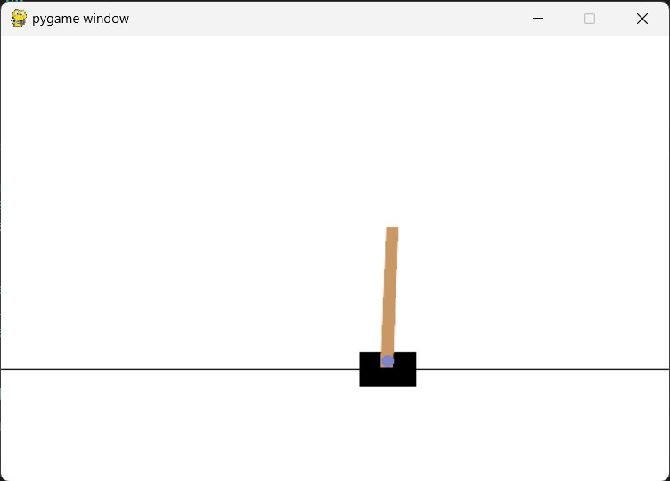
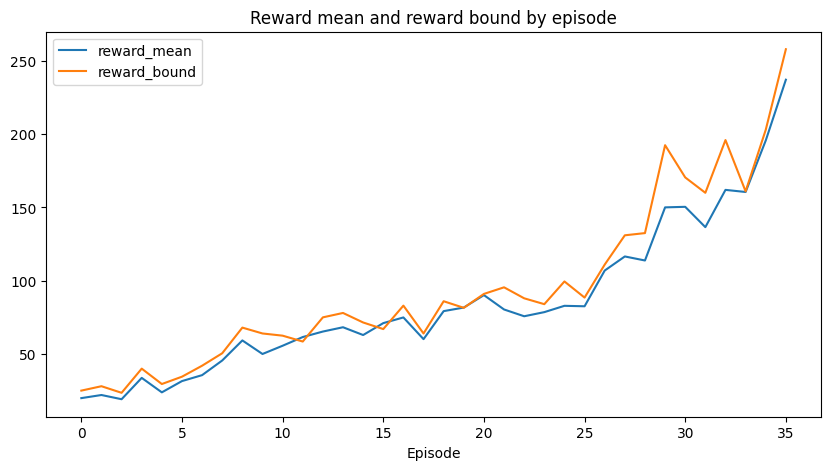
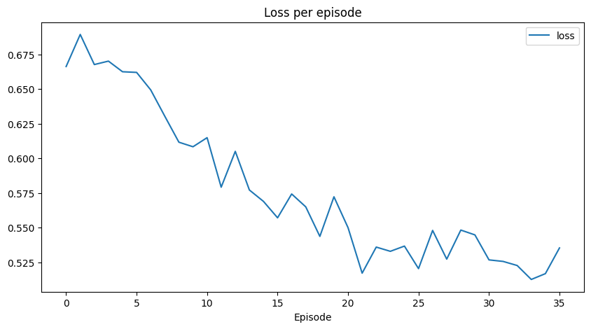

# CartPole-CrossEntropyMethod







## Installation

- OpenAI Gym:

```bash
pip install gym==0.26.2
```

- PyTorch:

```bash
pip install torch torchvision torchaudio
```

- PyGame:

```bash
pip install pygame==2.1.0
```

- Other dependencies:

```bash
pip install moviepy==1.0.3  
```